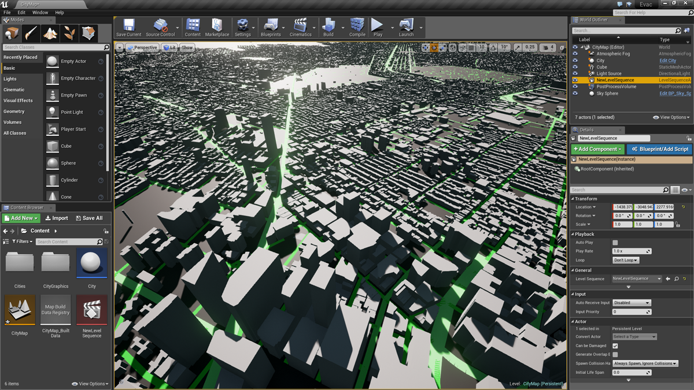
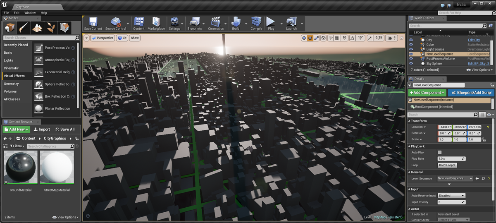
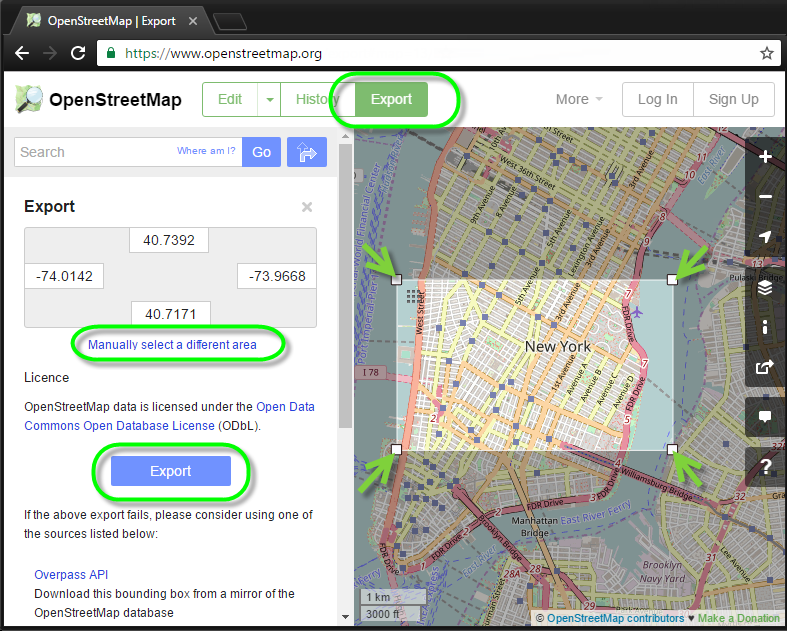

# Map View for Street in UE4

This plugin allows you to import **OpenPluginMapView** XML data your **Unreal Engine 4** project as a new PluginMapView asset type.  You can use the example **Street Map Component** to render streets and buildings.

*(Note: This plugin is a just a fun weekend project and not officially supported by Epic.)*

## Quick Start

It's easy to get up and running:

* Download the PluginMapView plugin source from this page (click **Clone or download** -> **Download ZIP**).

* Unzip the files into a new **PluginMapView** sub-folder under your project's **Plugins** folder.  It should end up looking like *"/MyProject/Plugins/PluginMapView/<files>"*

* **Rebuild** your C++ project.  The new plugin will be compiled too!

* Load the editor.  You can now drag and drop **OpenPluginMapView XML files** (.osm) into Content Browser to import map data!

* Create a **Street Map Component** and assign your new asset to the component's **Street Map** property.  You should now see your streets and buildings in the 3D viewport.

If the rebuild was successful but you don't see the new features, double check that the **Street Map** plugin is enabled by clicking the **Settings** toolbar button, then click **Plugins**.  Locate the **Street Map** plugin and make sure **Enabled** is checked.

If you're new to plugins in UE4, you can find lots of information [right here](https://wiki.unrealengine.com/An_Introduction_to_UE4_Plugins).

## Getting OpenPluginMapView Data

**Important:**  OpenPluginMapView data is licensed under the [ODC Open Database License (ODbL)](http://opendatacommons.org/licenses/odbl/).  If you use this data in your project, *make sure you understand and comply with the terms of that license*.

Here's how to get data for a location you're interested in:

* Go to [OpenPluginMapView.org](http://www.openpluginmapview.org) and use the search feature to navigate to your *favorite location on Earth*.

* Click the **Export** button on navigation bar at the top of the page to go into *Export Mode*.

* Scroll and zoom such that the region you want to export fills your browser window.  Start with something reasonably small so that the export and download will complete quickly.  Try zooming in on a small town or a city block.

* When you're ready, click **Export** on the left.  OpenPluginMapView will **generate an XML file** and initiate the download soon.  

If you want to fine tune the rectangle that's saved, you can click "Manually select a different area" in the OpenPluginMapView window, and adjust a rectangle over the map that will be exported.

Keep in mind that many locations may have limited information about building geometry.  In particular, the heights of buildings may be missing or incorrect in many cities.

If you receive an error message after clicking **Export**, OpenPluginMapView may be too busy to accomodate the request.  Try clicking **Overpass API** or check one of the other sources.  Make sure the downloaded file has the extension ".osm", as this is what the plugin will be expecting.  You can rename the downloaded file as needed.

Of course, there are many other places you can find raw OpenPluginMapView XML data on the web also, but keep in mind the plugin has only been tested with files exported directly from OpenPluginMapView so far.

## Plugin Details

### Street Map Assets

When you **import an OSM** file, the plugin will create a new **Street Map asset** to represent the map data in UE4.  You can assign these to **Street Map Components**, or directly interact with the map data in C++ code.

Roads are imported with *full connectivity data*!  This means you can design your own navigation algorithms pretty easily.

OpenPluginMapView positional data is stored in *geographic coordinates* (latitude and longitude), but UE4 doesn't support that coordinate system natively.  That is, we can't easily deal with spherical worlds in UE4 currently.  So during the import process, we project all map coordinates to a flat 2D plane.

The OSM data is imported at double precision, but we truncate everything to single precision floating point before saving our UE4 street map asset.  If you're planning to work with enormous map data sets at runtime, you'll need to modify this.

### Street Map Components

An example implementation of a **Street Map Component** is included that generates a renderable mesh from loaded street and building data.  This is a very simple component that you can use as a starting point.

The example implementation creates a custom primitive component mesh instead of a traditional static mesh.  The reason for this was to allow for more flexible rendering behavior of city streets and buildings, or even dynamic aspects.

All mesh data is generated at load time from the cartographic data in the map asset, including colorized road strips and simple building meshes with triangulated roof polygons.  No spline interpolation is performed on the roads.

The generated street map mesh has vertex colors and normals, and you can assign a custom material to it.  If you want to use the built-in colors, make sure your material multiplies Vertex Color with Base Color.  The mesh is setup to render very efficiently in a single draw call.  Roads are represented as simple quad strips (no tesselation).  Texture coordinates are not supported yet.

There are various "tweakable" variables to control how the renderable mesh is generated.  You can find these at the top of the *UPluginMapViewComponent::GenerateMesh()* function body.

*(Street Map Component also serves as a straightforward example of how to write your own primitive components in UE4.)*

### OSM Files

While importing OpenPluginMapView XML files, we store all of the data that's interesting to us in an **FOSMFile** data structure in memory.  This contains data that is very close to raw representation in the XML file.  Coordinates are stored as geographic positions in double precision floating point.

After loading everything into **FOSMFile**, we digest the data and convert it to a format that can be serialized to disk and loaded efficiently at runtime (the **UPluginMapView** class.)

Depending on your use case, you may want to heavily customize the **UPluginMapView** class to store data that is more close to the raw representation of the map.  For example, if you wanted to perform large-scale GPS navigation, you'd want higher precision data available at runtime.

### Known Issues

There are various loose ends.

* Importing files larger than 2GB will crash.  This is a current UE4 limitation.

* Some variants of generated OSM XML files won't load correctly.  For example, single-quote delimeters around values are not supported yet.

* Street Map APIs should be easy to use from C++, but Blueprint support hasn't been a focus for this plugin.  Many methods are inlined for high performance.  Blueprint scripting hooks could be added if there is demand for it, though.

* As mentioned above, coordinates are truncated to single-precision which won't be sufficient for advanced use cases.  Similarly, geographic coordinates are not retained beyond the initial import phase.  All coordinates are projected onto a plane and transposed to be relative to the center of the map's bounding rectangle.

* Runtime data structures are setup to support pathfinding (see **FPluginMapViewNode** member functions), but no example implementation of a GPS algorithm is included yet.

* Generated mesh data is currently very simple and lacks collision information, navigation mesh support and has no texture coordinates.  This is really just designed to serve as an example.  For more rendering flexibility and faster performance, the importer could be changed to generate actual Static Mesh assets for map geometry.

* You can search for **@todo** in the plugin source code for other minor improvements that could be made.

### Compatibility

This plug-in requires Visual Studio and either a C++ code project or the full Unreal Engine 4 source code from GitHub.  If you are new to programming in UE4, please see the official [Programming Guide](https://docs.unrealengine.com/latest/INT/Programming/index.html)! 

The Street Map plugin should work on all platforms that UE4 supports, but the latest version has not been tested on every platform.

We'll try to keep the source code up to date so that it works with new versions Unreal Engine as they are released.

## Support

I'm not planning to actively update the plugin on a regular basis, but if any critical fixes are contributed, I'll certainly try to review and integrate them.
 
For bugs, please [file an issue](https://github.com/sabrave/PluginMapView/issues), submit a [pull request](https://github.com/sabrave/PluginMapView/pulls?q=is%3Aopen+is%3Apr).

